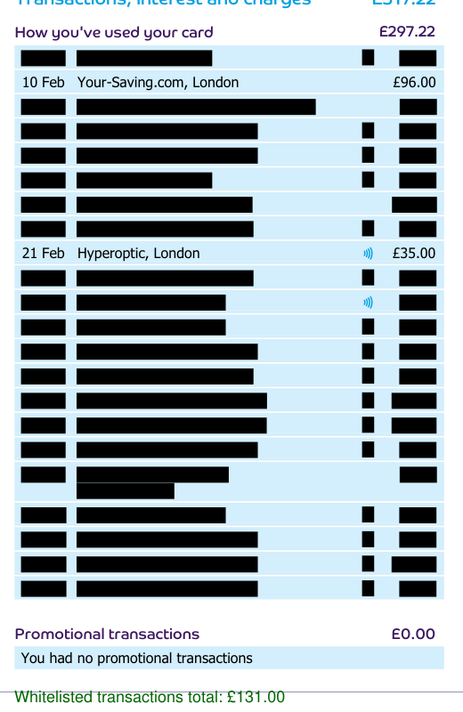

# PDF Credit Card Statement Redaction Tool

A Flask web application for redacting American Express and Barclaycard credit card statements. Users upload a PDF, select their credit card provider (or use auto-detection), and specify keywords - transactions matching those keywords are kept while all others are redacted.



Try it live at [pdf-redact.onrender.com](https://pdf-redact.onrender.com).

## Features

### 🏦 Supported Providers
- **American Express** - with enhanced privacy redaction
- **Barclaycard** - with enhanced privacy redaction  
- **Auto-detection** - automatically identifies provider from PDF content

### 🔒 Enhanced Privacy Options
- **Standard Redaction**: Filters transactions based on keywords
- **Enhanced Privacy**: Additional redaction of personal and financial details
  - Customer names, addresses, account numbers
  - Credit limits, balances, payment amounts
  - Rewards information, membership numbers
  - Preserves statement structure and essential information

### 🎯 Smart Transaction Processing
- **Span-by-span approach**: Reliable text processing for all providers
- **Keyword matching**: Case-insensitive search within transaction lines
- **Amount preservation**: Accurate totals for kept transactions
- **Same-line detection**: Finds keywords across text elements on the same line

## Quick Start

### Local Development

1. **Install dependencies**:
   ```bash
   pip install -r requirements.txt
   ```

2. **Run development server**:
   ```bash
   python app.py
   ```
   Server runs on http://127.0.0.1:5000

3. **Run in production mode**:
   ```bash
   gunicorn app:app
   ```

### Usage

1. Upload your credit card statement PDF (AMEX or Barclaycard)
2. Select provider (or leave as Auto-detect)
3. Enable Enhanced Privacy for additional redaction
4. Enter keywords to keep (comma-separated)
5. Download your redacted statement

**Example Keywords**: `Office Supplies, Travel, Client Dinner, TFL, Uber`

## Project Structure

```
pdf-redact/
├── app.py                      # Flask web application
├── redact_generic.py           # Main redaction engine
├── redact_financial_details.py # Enhanced privacy features
├── redact_transactions.py      # Legacy AMEX-specific redaction
├── provider_config.py          # Provider configurations
├── requirements.txt            # Python dependencies
├── Procfile                    # Heroku deployment config
├── CLAUDE.md                   # Development documentation
└── README.md                   # This file
```

## Core Modules

### `redact_generic.py`
- **`redact_pdf_generic()`**: Main redaction function using span-by-span approach
- Supports all providers with configurable patterns
- Reliable transaction filtering and amount calculation

### `redact_financial_details.py`
- **`redact_barclaycard_with_privacy()`**: Enhanced privacy for Barclaycard
- **`redact_amex_with_privacy()`**: Enhanced privacy for AMEX
- Redacts personal/financial details while preserving transaction data

### `provider_config.py`
- **`ProviderConfig`**: Data class for provider-specific settings
- **`PROVIDER_CONFIGS`**: All supported provider configurations
- **`detect_provider()`**: Auto-detection logic
- Date patterns, currency patterns, section headers

## Technical Details

- **PDF Processing**: PyMuPDF (fitz) for all PDF manipulation
- **Pattern Recognition**: Flexible regex patterns for dates and currencies
- **Provider Detection**: Content-based auto-detection with manual override
- **File Handling**: Temporary files with automatic cleanup
- **Privacy Focused**: No data storage, all processing in-memory
- **Usage Tracking**: Simple file-based counter with Google Analytics

## Configuration

The application is configured to work specifically with:
- **American Express UK statements** (MMM DD date format, £ currency)
- **Barclaycard statements** (DD MMM date format, £ currency)

Both providers support enhanced privacy redaction that removes personal and financial details while preserving transaction filtering functionality.

## License

MIT — see [LICENSE](LICENSE).

Please ensure you comply with your credit card provider's terms of service when processing statements.

## Contributing

1. Fork the repository
2. Create a feature branch
3. Make your changes
4. Test thoroughly with sample PDFs
5. Submit a pull request